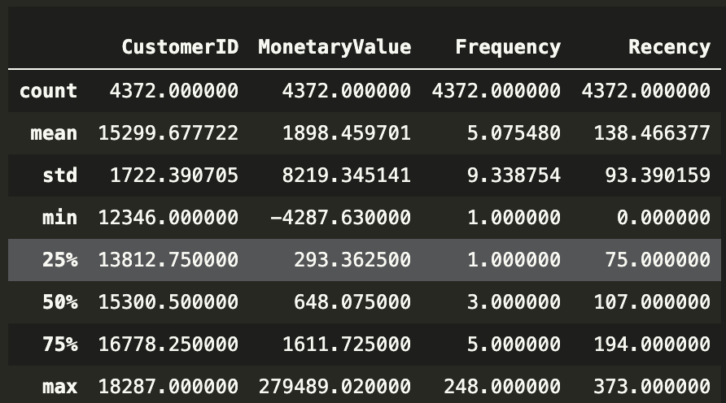
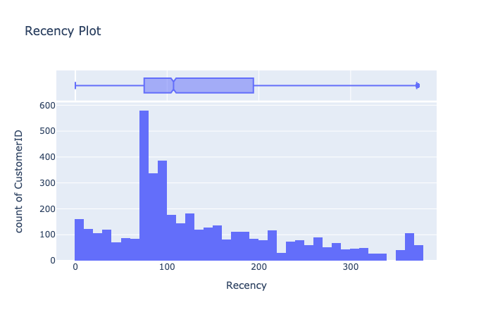
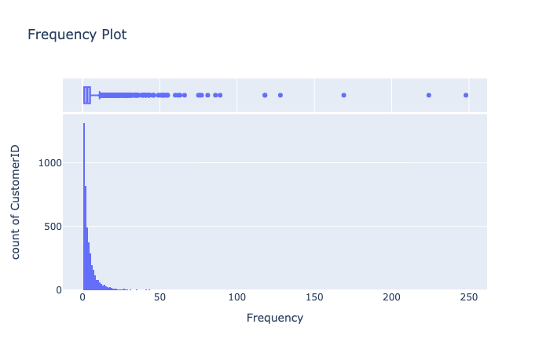
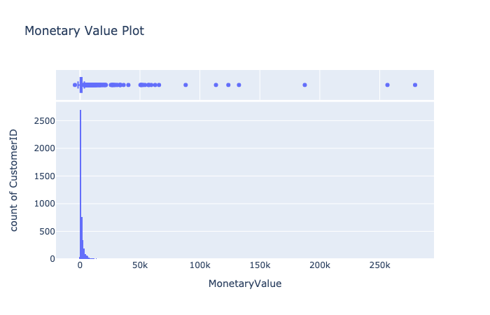
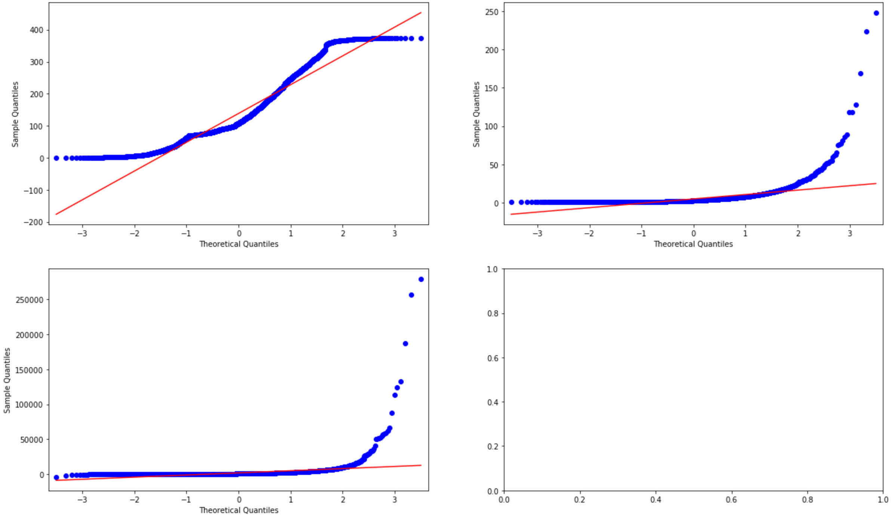
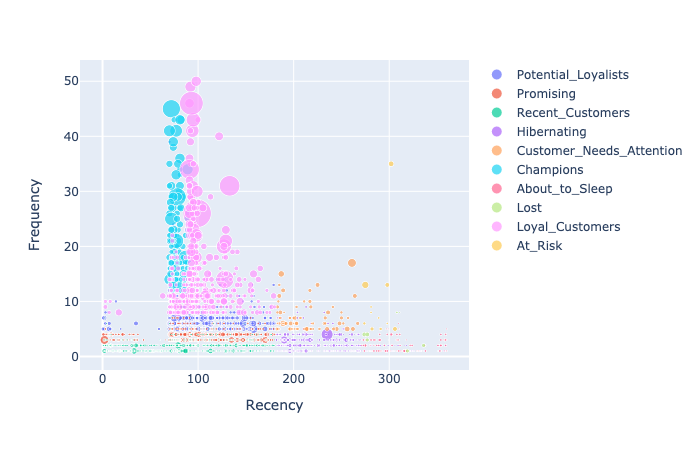

# RFM Model - Using Quantiles

RFM is a classic Lifetime and Responsiveness segmentation model. It has been trialed and tested over the years and is a great starting point for any retailer including eCommerce companies looking to manage their customer base more proactively. 

```
Recency (R) - Time since last purchase in days
Frequency (F) - Total number of purchases
Monetary value (M) - Total monetary value
```

* [RFM INFO](https://en.wikipedia.org/wiki/RFM_(market_research)) - More info
* [Quantiles](https://en.wikipedia.org/wiki/Quantile) - More info on quantiles

## Built With

* [Python 3.7](https://www.python.org/downloads/release/python-370/) - More information 

### Libraries to install 

```
pip install -r requirements.txt
```

or pip install 
```
plotly
pandas
numpy
scipy
statsmodels
matplotlib
streamlit
```

### Data

* [Find the Data here](https://www.kaggle.com/carrie1/ecommerce-data) - Download the publik dataset from here

## The Model

You can find the code in the model model.py file 

### Review the Output of the model
After running the model and writing the csv file. You can use a basic streamlit app also included in the repository names app.py. The app will allow you to do analyse and review a number of variable in the output in order to optimise your model. Male sure that you are in the project folder.  
```
streamlit run app.py
```
Access the app vis the localhost link provided in command line. 

### Import the libraries and dataset

```Python
##########################################################################################################################################
### RFM MODEL ###
##########################################################################################################################################
import plotly.express as px
import statsmodels.api as sm
import pandas as pd
import numpy as np
import warnings
warnings.filterwarnings('ignore')

data = pd.read_csv('transaction_data.csv', encoding='ISO-8859-1')
```

### Create the customer table 

```Python
##########################################################################################################################################
### Create the Customer Table ###
##########################################################################################################################################

# Calculate Sales Value
data['sales_value'] = data['Quantity'] * data['UnitPrice']

# group columns by customer_id
rfmTable = data.groupby(
    ['CustomerID'], as_index=False
).agg(
    {
        'sales_value' :sum
    ,   'InvoiceNo': pd.Series.nunique
    ,   'InvoiceDate': max
    }
)

# Calculate recency
rfmTable['InvoiceDate'] = pd.to_datetime(rfmTable['InvoiceDate']) 
rfmTable['InvoiceDate'] = rfmTable.InvoiceDate.dt.date

today = rfmTable.InvoiceDate.max() #use the latest date in the dataset - in the real world this will be todays system date
rfmTable['Recency'] = (today - rfmTable['InvoiceDate']).dt.days #Days since last order
```

### Stats Tests

```Python
##########################################################################################################################################
### Stats Tests ###
##########################################################################################################################################

# first rename the columns to a more user friendly format
rfmTable = rfmTable.rename(columns={
    'sales_value':'MonetaryValue', 'InvoiceNo':'Frequency', 'InvoiceDate':'LastOrderDate'
    }
)
```


```Python
#show distribution of values
#recency
fig = px.histogram(rfmTable, x="Recency", y="CustomerID", marginal="box", # or violin, rug
                   hover_data=rfmTable.columns, title='Recency Plot')
fig.show()
```

```Python
#frequency
fig = px.histogram(rfmTable, x="Frequency", y="CustomerID", marginal="box", # or violin, rug
                   hover_data=rfmTable.columns, title='Frequency Plot')
fig.show()
```

```Python
#monetary value
fig = px.histogram(rfmTable, x="MonetaryValue", y="CustomerID", marginal="box", # or violin, rug
                   hover_data=rfmTable.columns, title='Monetary Value Plot')
fig.show()
```

```Python
#Q-Q plot of the quantiles of x versus the quantiles/ppf of a distribution.
# set up the plot figure
from statsmodels.graphics.gofplots import qqplot
from matplotlib import pyplot as plt
f, axes = plt.subplots(2, 2, figsize=(20,12))

#define distribution graphs
qqplot(rfmTable.Recency, line='r', ax=axes[0,0], label='Recency')
qqplot(rfmTable.Frequency, line='r', ax=axes[0,1], label='Frequency')
qqplot(rfmTable.MonetaryValue, line='r', ax=axes[1,0], label='MonetaryValue')

#plot all
plt.tight_layout()
```

### Build/Define the RFM score functions

```Python 
##########################################################################################################################################
### RFM Score Function ###
##########################################################################################################################################
# Detemine the dataset quantiles
q = np.arange(0, 1, 0.10).tolist()
quantiles = rfmTable.quantile(q=np.around(q,decimals=2))

# Send the quantiles to the dictionary
quantiles = quantiles.to_dict()

# Start creating the RFM segmentation table
rfmSegmentation = rfmTable[['CustomerID','MonetaryValue','Frequency','Recency']]

# We created to classes where high recency is bad and high frequency/ money is good
# 1. Arguments (x = value, work on intervals of 90 days)
def RClass(x):
    if x <= 90:
        return 1
    elif x <= 180:
        return 2
    elif x <= 270: 
        return 3
    elif x <= 360: 
        return 4
    elif x <= 540: 
        return 5    
    else:
        return 6
    
# 2. Arguments (x = value, p = frequency)
def FClass(x,p,d):
    if x <= d[p][0.3]:
        return 6
    elif x <= d[p][0.4]:
        return 5
    elif x <= d[p][0.6]:
        return 4
    elif x <= d[p][0.8]: 
        return 3
    elif x <= d[p][0.9]: 
        return 2
    else:
        return 1
    
# 3. Arguments (x = value, p = monetary_value)
def MClass(x,p,d):
    if x <= d[p][0.2]:
        return 6
    elif x <= d[p][0.4]:
        return 5
    elif x <= d[p][0.6]:
        return 4
    elif x <= d[p][0.8]: 
        return 3
    elif x <= d[p][0.9]: 
        return 2
    else:
        return 1

# 4. Customer Segment Arguments (x = value, slice by value distribution in order to segment stage)

def CustomerSegment(x):
    if x['R_Quartile'] ==1 and x['F_Quartile'] ==1 and x['M_Quartile'] ==1:
        return "Champions"
    elif x['R_Quartile'] <=2 and x['F_Quartile'] <=2 and x['M_Quartile'] <=2:
        return "Loyal_Customers"
    elif x['R_Quartile'] <=2 and x['F_Quartile'] <=3 and x['M_Quartile'] <=3:
        return "Potential_Loyalists"
    elif x['R_Quartile'] <=2 and x['F_Quartile'] <=4 and x['M_Quartile'] <=4:
        return "Promising"
    elif x['R_Quartile'] <=2 and x['F_Quartile'] <=6 and x['M_Quartile'] <=6:
        return "Recent_Customers"
    elif x['R_Quartile'] ==3 and x['F_Quartile'] <=3 and x['M_Quartile'] <=3:
        return "Customer_Needs_Attention"
    elif x['R_Quartile'] ==3 or x['R_Quartile'] ==4 and x['F_Quartile'] >=5 and x['M_Quartile'] >=5:
        return "Hibernating"
    elif x['R_Quartile'] ==4 and x['F_Quartile'] <=3 and x['M_Quartile'] <=3:
        return "At_Risk"
    elif x['R_Quartile'] ==4 and x['F_Quartile'] >=3 and x['M_Quartile'] >=3:
        return "About_to_Sleep"
    elif x['R_Quartile'] >=5 and x['F_Quartile'] >=3 and x['M_Quartile'] >=3:
        return "Lost"
    elif x['R_Quartile'] ==5 and x['F_Quartile'] <=3 and x['M_Quartile'] <=3:
        return "Cant_Lose_Them"
    elif x['R_Quartile'] ==6 and x['F_Quartile'] <=3 and x['M_Quartile'] <=3:
        return "High_Value_Sleeping"
    else:
        return "Lost"
```

### Apply the Functions

```Python
##########################################################################################################################################
### CALCULATE THE RFM SCORES ###
##########################################################################################################################################

# Scores
rfmSegmentation['R_Quartile'] = rfmSegmentation['Recency'].apply(RClass)
rfmSegmentation['F_Quartile'] = rfmSegmentation['Frequency'].apply(FClass, args=('Frequency',quantiles,))
rfmSegmentation['M_Quartile'] = rfmSegmentation['MonetaryValue'].apply(MClass, args=('MonetaryValue',quantiles,))

# Classify the RFM score for the customer base
rfmSegmentation['RFMClass'] = rfmSegmentation.R_Quartile.map(str) \
                            + rfmSegmentation.F_Quartile.map(str) \
                            + rfmSegmentation.M_Quartile.map(str)

# Classify customer segments based on RFM scores
rfmSegmentation['Customer Segment'] = rfmSegmentation.apply(lambda x: CustomerSegment(x), axis=1)
```
#### Illustrate the final segments in a scatter plot
```Python
#scatter plot to display segments
rfm_scatter = rfmSegmentation[(rfmSegmentation['MonetaryValue'] > 0) & (rfmSegmentation['Recency'] <=360) & (rfmSegmentation['Frequency'] <= 50)]
fig = px.scatter(rfm_scatter, x="Recency", y="Frequency", color="Customer Segment",
                 size='MonetaryValue', hover_data=['R_Quartile', 'F_Quartile', 'M_Quartile'])
fig.show()

# Save the results to a csv file
output_table = rfmSegmentation.to_csv('rfm_segments.csv')
```


### Deployment options

* Include the computations as a part of your ETL process (I use [KNIME](https://www.knime.com/)) - Include it as a step before writing the final customer lifetime table to your Data Warehouse.
* Have it run on a monthly cycle - then you have snapshots of how customers progress through the different segments over time. It is a great way to track if you are feeding enough customers into active segments to feed your MVP (most profitable customers).
* Trigger events based on scores or segments with your CRM or campaign management system.  

## Author

* **Francois van Heerden** - *Experience* - [LinkedIn Profile](https://www.linkedin.com/in/francois-van-heerden-9589825a/)

## Acknowledgments

* Found inspiration from multiple fellow Data Scientists in the open source community
* But I would like to specifically highlight this post [How to segment customer with RFM analysis](https://joaocorreia.io/blog/rfm-analysis-increase-sales-by-segmenting-your-customers.html) 
